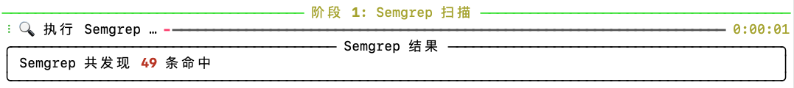
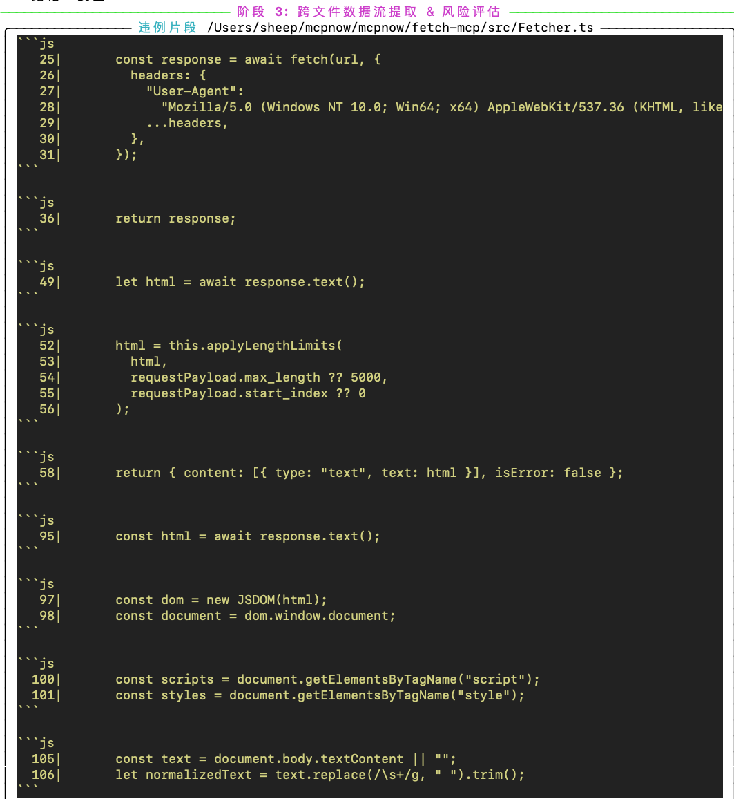

# MCPScan

> **一款基于 MCP（Model Context Protocol）的多阶段 AI 智能体安全扫描器**


> 📝 **论文即将发布**

---

## 🔍 项目简介

`MCP Scanner` 是一个轻量但强大的工具，用于审计 AI Agent 所使用的工具与插件生态。

它结合了 **静态污点分析**（基于 Semgrep 规则）与 **动态大模型评估**，可检测：
- 用于提示注入的恶意元数据
- 不安全的工具实现（如危险的文件读取）
- 兼容 MCP 协议的服务中的代码级漏洞

支持扫描本地代码仓库或远程 GitHub 仓库。


[📄 English README](README.md)

---

## ✨ 功能特点

+ **阶段一（Semgrep 静态污点扫描）**  
  使用静态规则检测代码中的污点源和污点汇。

+ **阶段二（元数据监测，可选）**  
  使用大模型分析工具的 `description` 字段，输出标签：`malicious`、`safe`、`suspect`。

+ **阶段三（跨文件代码追踪与风险判断，可选）**  
  对高风险代码构建跨文件代码流，最终由大模型判定风险等级（`HIGH` / `LOW`）。

+ **灵活的 CLI 控制**  
  可自定义每个阶段、规则集和输出格式。

---

## 🧠 可检测的风险类型

| 类型 | 示例 |
|------|------|
| 🧬 工具元数据污染 | 可被注入提示的 `description` 内容 |
| 🧪 工具投毒 | 工具中嵌入恶意 URL 或 shell 代码 |
| 🔁 间接提示注入 | 工具返回内容未处理直接传入大模型 |
| 🧰 影子工具 | 未正常注册的工具定义 |
| 📤 数据外泄 | 向用户暴露敏感文件/网络数据读取 |
| ☠️ 恶意代码片段 | 包含命令注入、eval()、os.system() 等 |

---

## 🧰 安装方式

### 依赖环境

+ Python 3.8 或更高版本
+ Semgrep
+ DeepSeek API Key

```bash
pip install semgrep
export DEEPSEEK_API_KEY="your_actual_api_key_here"
```

### 安装 MCP Scanner

```bash
git clone https://github.com/your-org/mcp-scanner.git
cd mcp-scanner
pip install -e .
```

安装完成后，可使用 `mcpscan` 作为全局命令。

---

## ⚙️ 配置说明（可选）

+ 自定义 Semgrep 规则：放入 `config/semgrep_rules.yml`
+ 使用自定义配置文件：`--config <FILE>`

---

## 🚀 使用说明

### 检查版本
```bash
mcpscan --version
# mcpscan 0.1.0
```

### CLI 参数

| 参数 | 说明 | 默认值 |
|------|------|--------|
| `<code_address>` | 要扫描的本地路径或 GitHub 仓库 | - |
| `--config <FILE>` | 自定义 Semgrep 规则 | config/semgrep_rules.yml |
| `--monitor-desc / --no-monitor-desc` | 是否启用 LLM 元数据分析 | ✅ 启用 |
| `--monitor-code / --no-monitor-code` | 是否启用代码流扫描 | ✅ 启用 |
| `--save / --no-save` | 是否保存 JSON 输出 | ✅ 启用 |
| `--lang <LANG>` | 强制指定语言 | auto |
| `--out <FILE>` | 输出文件名 | triage_report.json |

### 命令
```bash
# 扫描本地仓库
mcpscan scan ./my-repo

# 跳过元数据扫描
mcpscan scan ./my-repo --no-monitor-desc

# 扫描远程仓库，且不保存文件
mcpscan scan https://github.com/you/repo --no-monitor-code --no-save

# 使用自定义规则 + 强制语言设置
mcpscan scan ./project -c config/semgrep_rules.yml --lang javascript
```

### 试例命令
```bash

# SFull scan of local repo
mcpscan scan example/fetch


# Scan GitHub repo, no file save
mcpscan scan https://github.com/smithery-ai/mcp-fetch.git


```

---

## 🧭 扫描流程

| 阶段 | 截图 |
|------|------|
| 阶段 1: Semgrep 扫描结果 |  |
| 阶段 2: LLM 元数据分析 |  |
| 阶段 3: 代码风险检测 |  |
| 阶段 4: 代码关系与风险判定 |  |
| 最终输出（终端 + JSON） |  |

可通过 `--monitor-desc`、`--monitor-code`、`--save` 开关控制阶段。

---

## 👨‍💻 作者团队

本项目由以下人员开发与维护：
沙泽阳，陈昌骅，崔世文，孟昌华，王维强

---

## 🤝 贡献

欢迎通过 Issue 或 Pull Request 贡献。
如果你正在构建安全的 LLM Agent，或需要高级 MCP 安全评估工具，欢迎联系我们。

---

## 📄 引用

如您在研究或产品中使用 **MCP Scanner**，请引用：

```bibtex
@misc{sha2025mcpscan,
  title={MCPSCAN},
  author={Zeyang Sha and Changhua Chen and Shiwen Cui and Changhua Meng and Weiqiang Wang},
  year={2025},
  url={https://github.com/antgroup/Trustworthy_LM/mcpscan}
}
```

---

## 📜 开源协议

本项目基于 Apache License 2.0 开源。
